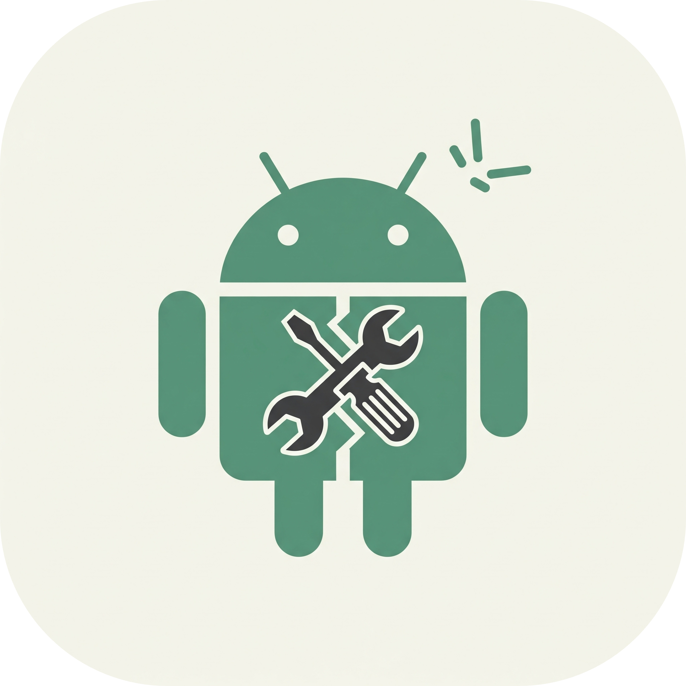

# DebugManager

{width="200px" height="200px"}

## 最新版本

[Github Release v2.1.0](https://github.com/stepheneasyshot/DebugManager/releases/tag/v2.1.0)

## 介绍

Desktop端调试车机Android设备的软件，基于Compose Multiplatform，支持Windows，Linux，MacOS三个平台。

## 声明

本软件仅用于学习交流，请勿用于非法用途，否则后果自负。

## 功能说明

### 设备信息

1. root和remount，这两个是点击后自动执行adbd获取root权限，remount重载。一般情况下这两个操作会在刚启动软件就自动执行，特殊的场景下可能需要手动点击。如果刚刷完机，最好打开软件后立即重启一次设备，使文件系统重载生效，否则很多文件相关的功能可能会执行失败
2. 抓取trace，在进行性能分析时使用，自动执行为期10s的trace记录，抓取完毕会自动提取到电脑桌面
3. 打开google设置，可以打开内置的原生Settings，一般需要开启某些调试开关时使用
4. fastboot和recovery，这两个操作会直接重启到对应模式
5. 打开投屏，可以将车机画面投屏到电脑上，在台架没有屏幕时，或者远距离操作车机时使用
6. 录屏，可以自定义输入录屏时长，录屏期间屏幕上会显示一个手指点按位置的小点，记录操作，预设的录屏时间到了之后，会自动把录屏MP4提取到电脑桌面，之后不再显示手指点按位置的小点；
7. 截屏，把此时屏幕上的显示图像自动提取到桌面。使用完毕建议点击清空缓存，以免占用车机存储空间。
8. 最下面有一些模拟按键输入的按钮，模拟侧滑返回，回到launcher桌面，亮灭屏，音量加减等，还可以将文本输入到输入框内，输入功能目前只支持英文和数字。

### APP管理

1. 上方的软件安装，可以选取电脑中的apk文件。再配置正确的安装参数，降级安装，覆盖安装等，可将apk安装到系统。一般在安装第三方的apk做验证时使用，需要注意车机系统内置的priv-app，不可以通过install来更新，只能通过下面的push功能来置换。
2. 下面的app列表展示了此系统里的一些软件的名称，版本，包名，更新时间，列表可以选择筛选后的精简部分还是显示全部app。每个条目最右侧有三个点，点开则为更详细的操作弹窗。
3. 打开应用界面，可以直接打开对应app的主界面，需要注意这个对于Activity驱动的普通app可以生效，而对于空调，座椅，allapp这种悬浮窗架构的app是不生效的。
4. 卸载，一般用于直接run进去的app，或者第三方app，对于系统预制的app，直接利用uninstall卸载是没有用的，只能移除apk来实现。
5. 提取apk，将对应系统内软件的apk文件提取到桌面。
6. 置换apk，选择电脑端的apk文件，替换掉车机里面原来的apk，达到精准更新软件的目的，适合在不刷机的情况下进行小范围验证操作。选择文件后点击开始PUSH，就会自动替换了。在所有的待替换的apk更新完毕之后，重启设备，下次开机即为新的apk了。注意PUSH的耗时时间和apk体积有关，100Mb以上的apk文件，push后请等待10s以上，再进行重启。

### 文件管理

文件管理界面，提供了更精细的文件操作:

1. 可以在Android设备内部创建，删除，移动，复制文件和文件夹。
2. 还可以支持电脑文件的推送，android设备文件的拉取。
3. 现已支持文件拖动添加
4. 请非专业人员不要进行文件的删除和移动操作，以免造成车机异常。
5. 上方提供了一些快捷操作按钮，可以返回上级页面，根目录，sdcard页面，priv-app页面，达到快速切换目录。
   目前区分不了link类型的文件夹，其会被识别成文件，但是可以通过其真实的路径一步一步访问到。

### 命令界面

这个页面是一些输入指令的调试功能。

1. 最上方是adb操作，注意这里没有加入上下文机制，适合执行单次生效的命令，像reboot，发送广播，更新系统数据库，拉起activity，拉起service等。
2. 在车机上我们还联动语音可见模拟，进行快速调试
3. 内部版本同时也支持了carservice信号可视化模拟

### 性能监测

1. 左侧是系统总体占用概览，可以查看cpu和内存信息
2. 右侧是根据每一个app，查看其各个进程的cpu和内存占用情况

### AI体验

现在的软件不集成下大模型，感觉都落伍了。

本软件目前对接了Kimi开发者平台，使用ktor进行网络数据请求，与大模型对话。现已完善基本的Ui和通信架构。

后续将添加更多大模型api通信，像Deepseek，千问等。

### 关于页

1. 展示软件版本号，开源项目链接。
2. 电脑上两个缓存文件夹的快速入口。
3. 还有主题切换功能，目前是深浅两套，后期计划完全适配Material Design，并加入多套动态主题。

### 自适应布局
支持自适应布局，采用了最小窗口尺寸设定、流式布局和自动折叠侧边栏等策略。

保证在不同窗口尺寸下，也能有较好的交互和页面表现。

一下是部分页面自适应的运行情况：

  
  

  
  

  
  

